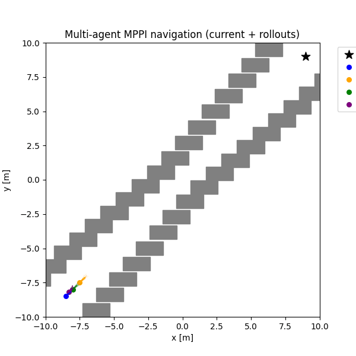

# Reference
This repository is based on [mppi_playground](https://github.com/kohonda/mppi_playground) by kohonda and [mppi_cem_tutorial](https://github.com/junyoungg/mppi_cem_tutorial) by junyoungg

# Objective
Demonstrate the effectiveness of the proposed **fully decentralized MPPI** framework for multi-agent systems

---

## Baseline: Naive Implementation

  

Each agent treats other agents as static obstacles. As a result:

- Agents frequently **hesitate** or take unnecessarily long paths.
- Overall behavior is **inefficient**, especially in dense environments.

---

## Proposed Method: Fully Decentralized MPPI

In the proposed method

- Each agent **shares predicted trajectories** with nearby neighbors within a certain distance
- Neighbors are treated as **moving obstacles** when computing the cost functional.
- Agents **actively avoid collisions** while navigating efficiently
- All agents reach the destination in **shorter time** with smoother and more coordinated motion.
